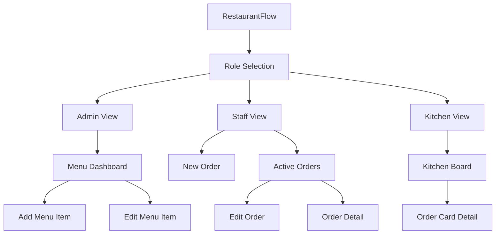
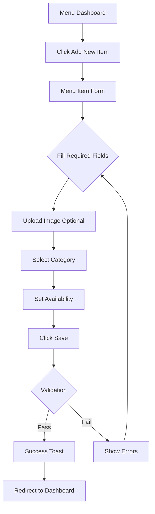
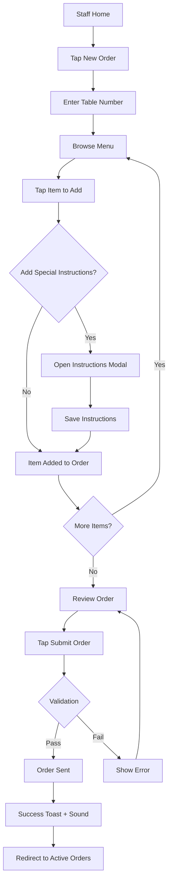
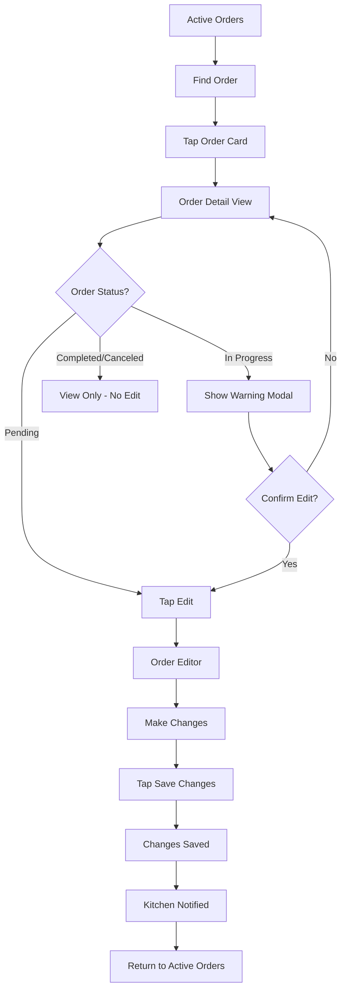
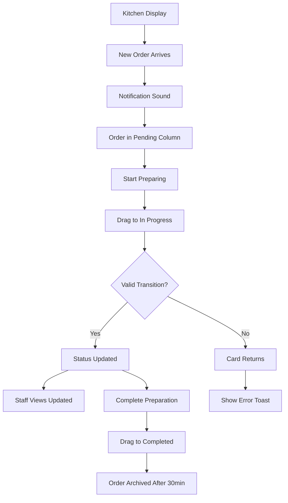

# RestaurantFlow UI/UX Specification

---

## Introduction

This document defines the user experience goals, information architecture, user flows, and visual design specifications for RestaurantFlow's user interface. It serves as the foundation for visual design and frontend development, ensuring a cohesive and user-centered experience optimized for the fast-paced restaurant environment.

### Overall UX Goals & Principles

#### Target User Personas

| Persona | Description | Primary Goals | Context |
|---------|-------------|---------------|---------|
| **Admin (Manager)** | Restaurant manager or owner who configures the system | Quickly update menu, manage availability, maintain accurate pricing | Uses desktop/laptop, typically during off-peak hours |
| **Staff (Server)** | Front-of-house servers taking customer orders | Fast, error-free order entry with minimal training | Uses tablet while standing, often in noisy environment |
| **Kitchen Staff** | Back-of-house cooks managing food preparation | At-a-glance order visibility, quick status updates | Uses wall-mounted display or tablet, hands often busy/dirty |

#### Usability Goals

1. **Speed of Task Completion:** Order entry completable in under 30 seconds
2. **Error Prevention:** Clear confirmations for destructive actions, undo options where possible
3. **Learnability:** New staff can use the system effectively within 10 minutes
4. **Glanceability:** Critical information readable from 3+ feet away (kitchen display)
5. **Touch Efficiency:** Primary actions achievable with minimal taps on touch devices

#### Design Principles

1. **Clarity Over Cleverness** — Prioritize obvious UI patterns over innovative but confusing designs
2. **Touch-First, Keyboard-Enhanced** — Design for touch targets first, add keyboard shortcuts for power users
3. **Real-Time Confidence** — Users should always trust the displayed information is current
4. **Progressive Disclosure** — Show essential info first, details on demand
5. **Forgiving Interactions** — Support undo, confirmation dialogs, and error recovery

### Change Log

| Date | Version | Description | Author |
|------|---------|-------------|--------|
| 2026-01-13 | 0.1 | Initial UI/UX specification | Sally (UX Expert) |

---

## Information Architecture (IA)

### Site Map / Screen Inventory



### Navigation Structure

**Primary Navigation:**
- Role-based: Each role (Admin, Staff, Kitchen) has its own dedicated navigation
- Minimal depth: Maximum 2 levels for any action
- Persistent header with role indicator and role-switch option

**Secondary Navigation:**
- Admin: Tab-based navigation within Menu Management (All Items, By Category, Availability)
- Staff: Tab-based order filtering (All Orders, My Orders, By Status)
- Kitchen: Status columns serve as implicit navigation

**Breadcrumb Strategy:**
- Not required due to shallow navigation structure
- Current location indicated via active nav state and page title

---

## User Flows

### Flow 1: Admin — Create Menu Item

**User Goal:** Add a new menu item to the restaurant's menu

**Entry Points:** Menu Dashboard → "Add New Item" button

**Success Criteria:** Item appears in menu list and is available for order entry



**Edge Cases & Error Handling:**
- Image upload fails: Show error, allow retry, don't lose form data
- Duplicate item name: Warn but allow (different categories may have same name)
- Network error: Show retry option, preserve form state
- Required field missing: Inline validation with clear field highlighting

---

### Flow 2: Staff — Create and Submit Order

**User Goal:** Take a customer's order and send it to the kitchen

**Entry Points:** Staff home → "New Order" button

**Success Criteria:** Order appears in kitchen display with all items correct



**Edge Cases & Error Handling:**
- Item becomes unavailable during order: Alert staff, remove item, offer alternatives
- Network disconnect: Queue order locally, submit when reconnected, show pending state
- Empty order submission: Disable submit button, show minimum item requirement
- Duplicate item added: Increment quantity rather than add duplicate line

---

### Flow 3: Staff — Edit Submitted Order

**User Goal:** Modify an order after it's been sent to kitchen

**Entry Points:** Active Orders → Order Card → Edit button

**Success Criteria:** Changes reflected in kitchen display immediately



**Edge Cases & Error Handling:**
- Editing IN_PROGRESS order: Show warning "Kitchen has started this order"
- Concurrent edit conflict: Last-write-wins with notification to other editor
- Item no longer available: Cannot add, show unavailable badge

---

### Flow 4: Kitchen — Process Order via Drag-and-Drop

**User Goal:** Update order status as it moves through preparation

**Entry Points:** Kitchen Display (persistent view)

**Success Criteria:** Status change reflected for all connected clients immediately



**Edge Cases & Error Handling:**
- Invalid status transition: Card snaps back, show error toast
- Network error during drag: Optimistic update, revert if fails, show retry
- Rapid status changes: Debounce to prevent conflicts
- Order edited while in progress: Card flashes, show "Updated" badge

---

## Wireframes & Key Screen Layouts

### Screen 1: Admin — Menu Management Dashboard

**Purpose:** Central hub for viewing, filtering, and managing all menu items

```
┌─────────────────────────────────────────────────────────────────┐
│  🍽️ RestaurantFlow          [Admin ▼]              [Switch Role]│
├─────────────────────────────────────────────────────────────────┤
│                                                                 │
│  Menu Management                              [+ Add New Item]  │
│                                                                 │
│  ┌──────────────────────────────────────────────────────────┐  │
│  │ Filter: [All Categories ▼]  [All Types ▼]  🔍 Search...  │  │
│  └──────────────────────────────────────────────────────────┘  │
│                                                                 │
│  ┌─────────────────────────────────────────────────────────────┐│
│  │ 🖼️ │ Name           │ Price  │ Category │ Type   │ ● │ ⋮  ││
│  ├────┼────────────────┼────────┼──────────┼────────┼───┼────┤│
│  │ 📷 │ Caesar Salad   │ $12.99 │ Appetizer│ Salad  │🟢 │ ✏️🗑│├
│  │ 📷 │ Margherita     │ $18.99 │ Main     │ Pizza  │🟢 │ ✏️🗑│├
│  │ 📷 │ Spaghetti Carb │ $16.99 │ Main     │ Pasta  │🔴 │ ✏️🗑│├
│  │ 📷 │ Tiramisu       │ $8.99  │ Dessert  │ Dessert│🟢 │ ✏️🗑│├
│  │ 📷 │ Espresso       │ $3.99  │ Drink    │ Coffee │🟢 │ ✏️🗑│├
│  └─────────────────────────────────────────────────────────────┘│
│                                                                 │
│  Showing 5 of 24 items                          [< 1 2 3 4 >]  │
│                                                                 │
└─────────────────────────────────────────────────────────────────┘

Legend:
🟢 = Available (toggle to 86)
🔴 = 86'd / Unavailable
✏️ = Edit
🗑 = Delete
⋮  = More actions
```

**Key Elements:**
- Header with role indicator and role-switch option
- "Add New Item" prominent call-to-action button
- Filter controls: Category dropdown, Food Type dropdown, Search input
- Data table with thumbnail, name, price, category, type, availability toggle
- Quick actions: Edit (pencil), Delete (trash) inline per row
- Availability toggle switch for instant 86/un-86

**Interaction Notes:**
- Clicking row (not action buttons) could expand for quick view
- Availability toggle updates immediately with optimistic UI
- Delete shows confirmation modal before executing
- Empty state shows "No menu items yet. Add your first item!"

---

### Screen 2: Admin — Menu Item Form (Create/Edit)

**Purpose:** Form for creating new or editing existing menu items

```
┌─────────────────────────────────────────────────────────────────┐
│  🍽️ RestaurantFlow          [Admin ▼]              [Switch Role]│
├─────────────────────────────────────────────────────────────────┤
│                                                                 │
│  ← Back to Menu                                                 │
│                                                                 │
│  Add New Menu Item  (or "Edit: Caesar Salad")                   │
│                                                                 │
│  ┌─────────────────────────────────────────────────────────────┐│
│  │                                                             ││
│  │  ┌──────────────────────────┐  ┌────────────────────────┐  ││
│  │  │                          │  │ Name *                 │  ││
│  │  │      📷 Drop image       │  │ ┌──────────────────┐   │  ││
│  │  │      or click to upload  │  │ │                  │   │  ││
│  │  │                          │  │ └──────────────────┘   │  ││
│  │  │  [Remove]                │  │                        │  ││
│  │  └──────────────────────────┘  │ Price *                │  ││
│  │                                │ ┌──────────────────┐   │  ││
│  │                                │ │ $                │   │  ││
│  │                                │ └──────────────────┘   │  ││
│  │                                └────────────────────────┘  ││
│  │                                                             ││
│  │  Category *                    Food Type *                  ││
│  │  ┌────────────────────┐        ┌────────────────────┐      ││
│  │  │ Select category ▼  │        │ Select type ▼      │      ││
│  │  └────────────────────┘        └────────────────────┘      ││
│  │                                                             ││
│  │  Ingredients                                                ││
│  │  ┌────────────────────────────────────────────────────┐    ││
│  │  │ [Romaine] [Parmesan] [Croutons] [+ Add]            │    ││
│  │  └────────────────────────────────────────────────────┘    ││
│  │                                                             ││
│  │  ☑ Available for ordering                                  ││
│  │                                                             ││
│  │                                                             ││
│  │                               [Cancel]  [Save Menu Item]   ││
│  │                                                             ││
│  └─────────────────────────────────────────────────────────────┘│
│                                                                 │
└─────────────────────────────────────────────────────────────────┘
```

**Key Elements:**
- Back navigation link to Menu Dashboard
- Image upload zone with drag-and-drop support
- Required fields marked with asterisk (*)
- Category and Food Type dropdowns
- Ingredients as tag/chip input (add/remove)
- Availability checkbox
- Cancel and Save action buttons

**Interaction Notes:**
- Inline validation on blur for required fields
- Price input restricts to valid currency format
- Image preview shows after upload
- Save button disabled until required fields valid
- Cancel prompts "Discard changes?" if form is dirty

---

### Screen 3: Staff — Order Entry Screen

**Purpose:** Create orders by browsing menu and building order cart

```
┌─────────────────────────────────────────────────────────────────┐
│  🍽️ RestaurantFlow          [Staff ▼]              [Switch Role]│
├─────────────────────────────────────────────────────────────────┤
│                                                                 │
│  ┌─────────────────────────────────┬───────────────────────────┐│
│  │                                 │                           ││
│  │  Menu                           │  Order #NEW               ││
│  │                                 │                           ││
│  │  🔍 Search items...             │  Table: [___]  Server: [__]│
│  │                                 │                           ││
│  │  [Appetizers][Mains][Drinks][De │  ───────────────────────  ││
│  │                                 │                           ││
│  │  ┌─────────┐ ┌─────────┐ ┌────  │  Caesar Salad        1x   ││
│  │  │  📷     │ │  📷     │ │  📷  │  $12.99                   ││
│  │  │ Caesar  │ │ Brusche │ │ Soup │  [+instructions]  [−][+]  ││
│  │  │ Salad   │ │ tta     │ │      │                           ││
│  │  │ $12.99  │ │ $9.99   │ │$8.99 │  ───────────────────────  ││
│  │  └─────────┘ └─────────┘ └────  │                           ││
│  │                                 │  Margherita Pizza    2x   ││
│  │  ┌─────────┐ ┌─────────┐ ┌────  │  $37.98                   ││
│  │  │  📷     │ │  📷     │ │  📷  │  "No olives, extra cheese"││
│  │  │ Margher │ │ Spaghett│ │ Ribs │  [−][+]                   ││
│  │  │ ita     │ │ i       │ │      │                           ││
│  │  │ $18.99  │ │ $16.99  │ │$24.99│  ───────────────────────  ││
│  │  └─────────┘ └─────────┘ └────  │                           ││
│  │                                 │  Espresso            1x   ││
│  │  ┌─────────┐ ┌─────────┐ ┌────  │  $3.99                    ││
│  │  │  📷     │ │  📷     │ │  📷  │  [−][+]                   ││
│  │  │ Tiramisu│ │ Espresso│ │ Wine │                           ││
│  │  │ $8.99   │ │ $3.99   │ │$9.99 │                           ││
│  │  └─────────┘ └─────────┘ └────  │                           ││
│  │                                 │                           ││
│  │                                 │  ═══════════════════════  ││
│  │                                 │  TOTAL:          $54.96   ││
│  │                                 │                           ││
│  │                                 │  [Clear] [Submit Order ▶] ││
│  │                                 │                           ││
│  └─────────────────────────────────┴───────────────────────────┘│
│                                                                 │
└─────────────────────────────────────────────────────────────────┘
```

**Key Elements:**
- Split view: Menu browser (left 60%), Order builder (right 40%)
- Search input with instant filtering
- Category tabs for quick filtering
- Menu item cards: image, name, price (tap to add)
- Order builder: Table #, Server name inputs
- Line items with quantity controls, instructions, remove
- Running total at bottom
- Clear and Submit Order buttons

**Interaction Notes:**
- Tapping menu card adds item with qty 1 (or increments if exists)
- Quantity adjustable with +/- buttons (min 1, tap-and-hold for rapid)
- Instructions opens modal for text input
- Submit disabled until: table #, server name, at least 1 item
- Clear shows confirmation if items exist
- Touch targets minimum 44x44px

---

### Screen 4: Staff — Active Orders List

**Purpose:** View and manage submitted orders with status visibility

```
┌─────────────────────────────────────────────────────────────────┐
│  🍽️ RestaurantFlow          [Staff ▼]              [Switch Role]│
├─────────────────────────────────────────────────────────────────┤
│                                                                 │
│  Active Orders                                  [+ New Order]   │
│                                                                 │
│  [All Orders] [My Orders] [By Status ▼]           🔄 Refresh   │
│                                                                 │
│  ┌─────────────────────────────────────────────────────────────┐│
│  │                                                             ││
│  │  ┌────────────────────────────┐  ┌────────────────────────┐││
│  │  │ Order #127         🔵      │  │ Order #126         🟡  │││
│  │  │ Table 5      ⏱️ 3 min     │  │ Table 12     ⏱️ 8 min  │││
│  │  │ Server: John               │  │ Server: Maria          │││
│  │  │ 4 items                    │  │ 2 items                │││
│  │  │                            │  │                        │││
│  │  │ [View] [Edit]              │  │ [View]                 │││
│  │  └────────────────────────────┘  └────────────────────────┘││
│  │                                                             ││
│  │  ┌────────────────────────────┐  ┌────────────────────────┐││
│  │  │ Order #125         🟢      │  │ Order #124         🔴  │││
│  │  │ Table 3      ⏱️ 15 min    │  │ Table 8      ⏱️ 22 min │││
│  │  │ Server: John               │  │ Server: Alex           │││
│  │  │ 3 items                    │  │ 1 item                 │││
│  │  │                            │  │                        │││
│  │  │ [View]                     │  │ [View]                 │││
│  │  └────────────────────────────┘  └────────────────────────┘││
│  │                                                             ││
│  └─────────────────────────────────────────────────────────────┘│
│                                                                 │
│  Legend: 🔵 Pending  🟡 In Progress  🟢 Completed  🔴 Halted    │
│                                                                 │
└─────────────────────────────────────────────────────────────────┘
```

**Key Elements:**
- Filter tabs: All Orders, My Orders (by server name)
- Status filter dropdown
- Manual refresh button (plus auto-refresh via WebSocket)
- Order cards in grid layout showing: order #, table, server, status, time, item count
- Status badges with color coding
- Edit button only on Pending orders
- View button on all orders

**Interaction Notes:**
- Cards update in real-time as status changes
- Subtle animation when status changes
- Tapping card opens Order Detail modal/view
- "My Orders" filters by current server name
- New orders animate in from top

---

### Screen 5: Kitchen — Kitchen Display Board (Kanban)

**Purpose:** Real-time order queue with drag-and-drop status management

```
┌─────────────────────────────────────────────────────────────────────────────────┐
│  🍽️ RestaurantFlow Kitchen                    🔔 [Mute] [🟢 Connected] [12:34 PM]│
├─────────────────────────────────────────────────────────────────────────────────┤
│                                                                                 │
│  ┌───────────────────┐ ┌───────────────────┐ ┌───────────────────┐ ┌───────────┐│
│  │  🔵 PENDING (3)   │ │  🟡 IN PROGRESS (2)│ │  ⚫ HALTED (1)    │ │ 🟢 DONE   ││
│  ├───────────────────┤ ├───────────────────┤ ├───────────────────┤ ├───────────┤│
│  │                   │ │                   │ │                   │ │           ││
│  │ ┌───────────────┐ │ │ ┌───────────────┐ │ │ ┌───────────────┐ │ │ ┌───────┐ ││
│  │ │ #127 Table 5  │ │ │ │ #124 Table 8  │ │ │ │ #121 Table 2  │ │ │ │ #120  │ ││
│  │ │ ⏱️ 3 min      │ │ │ │ ⏱️ 12 min 🟡  │ │ │ │ ⏱️ 18 min     │ │ │ │ ✓     │ ││
│  │ │───────────────│ │ │ │───────────────│ │ │ │───────────────│ │ │ └───────┘ ││
│  │ │ 2x Margherita │ │ │ │ 1x Ribeye     │ │ │ │ 1x Soup       │ │ │           ││
│  │ │ 1x Caesar     │ │ │ │   *med-rare*  │ │ │ │   *86'd item* │ │ │ ┌───────┐ ││
│  │ │ 1x Espresso   │ │ │ │ 2x Fries      │ │ │ │               │ │ │ │ #119  │ ││
│  │ │───────────────│ │ │ │               │ │ │ │ Reason: OOS   │ │ │ │ ✓     │ ││
│  │ │ Server: John  │ │ │ │ Server: Maria │ │ │ │               │ │ │ └───────┘ ││
│  │ └───────────────┘ │ │ └───────────────┘ │ │ └───────────────┘ │ │           ││
│  │                   │ │                   │ │                   │ │           ││
│  │ ┌───────────────┐ │ │ ┌───────────────┐ │ │                   │ │           ││
│  │ │ #126 Table 12 │ │ │ │ #123 Table 7  │ │ │                   │ │           ││
│  │ │ ⏱️ 8 min      │ │ │ │ ⏱️ 15 min 🔴  │ │ │                   │ │           ││
│  │ │───────────────│ │ │ │───────────────│ │ │                   │ │           ││
│  │ │ 1x Pasta      │ │ │ │ 3x Pizza      │ │ │                   │ │           ││
│  │ │   *extra spicy*│ │ │ │               │ │ │                   │ │           ││
│  │ │───────────────│ │ │ │───────────────│ │ │                   │ │           ││
│  │ │ Server: Maria │ │ │ │ Server: Alex  │ │ │                   │ │           ││
│  │ └───────────────┘ │ │ └───────────────┘ │ │                   │ │           ││
│  │                   │ │                   │ │                   │ │           ││
│  │ ┌───────────────┐ │ │                   │ │                   │ │           ││
│  │ │ #125 Table 3  │ │ │                   │ │                   │ │           ││
│  │ │ ⏱️ 15 min 🟡  │ │ │                   │ │                   │ │           ││
│  │ │───────────────│ │ │                   │ │                   │ │           ││
│  │ │ 2x Salad      │ │ │                   │ │                   │ │           ││
│  │ │ 1x Soup       │ │ │                   │ │                   │ │           ││
│  │ └───────────────┘ │ │                   │ │                   │ │           ││
│  │                   │ │                   │ │                   │ │           ││
│  └───────────────────┘ └───────────────────┘ └───────────────────┘ └───────────┘│
│                                                                                 │
└─────────────────────────────────────────────────────────────────────────────────┘

Wait Time Indicators:
🟡 = Warning (>10 min pending, >30 min in progress)
🔴 = Critical (>20 min pending)
```

**Key Elements:**
- Four status columns: Pending, In Progress, Halted, Completed
- Column headers with status color and order count
- Order cards: order #, table #, elapsed time, items, special instructions, server
- Drag-and-drop between columns
- Wait time indicators with warning/critical colors
- Mute toggle for notification sounds
- Connection status indicator

**Interaction Notes:**
- Drag card to new column to change status
- Invalid transitions: card snaps back with error toast
- New orders: audio notification + card highlight animation
- Special instructions emphasized with different background
- Touch-friendly: large cards, generous spacing
- Completed column auto-hides orders after 30 minutes
- Time elapsed updates every minute

---

### Screen 6: Kitchen — Order Card (Expanded Detail)

**Purpose:** Full order details for complex orders or clarification

```
┌─────────────────────────────────────────────────────────────────┐
│                                                                 │
│   Order #127 — Table 5                              [✕ Close]   │
│                                                                 │
│   Status: 🔵 PENDING                    Elapsed: ⏱️ 3 minutes   │
│   Server: John                          Created: 12:31 PM       │
│                                                                 │
│   ─────────────────────────────────────────────────────────────│
│                                                                 │
│   ITEMS                                                         │
│                                                                 │
│   2x  Margherita Pizza                                          │
│       └─ 🗒️ "No olives, extra cheese"                          │
│                                                                 │
│   1x  Caesar Salad                                              │
│       └─ 🗒️ "Dressing on the side"                             │
│                                                                 │
│   1x  Espresso                                                  │
│                                                                 │
│   ─────────────────────────────────────────────────────────────│
│                                                                 │
│   [← Move to Pending] [Start →] [Mark Halted ⚠️]               │
│                                                                 │
└─────────────────────────────────────────────────────────────────┘
```

**Key Elements:**
- Order header: order #, table, status badge, time elapsed
- Server name and creation timestamp
- Full item list with quantities
- Special instructions highlighted per item
- Action buttons for status transitions

**Interaction Notes:**
- Opens as modal overlay or slide-out panel
- Action buttons show only valid transitions
- Close via X button or tap outside
- Keyboard: Escape to close

---

## Component Library / Design System

### Design System Approach

**Approach:** Custom lightweight design system using Tailwind CSS

Build a minimal component library focused on the specific needs of RestaurantFlow:
- Touch-optimized interactive elements
- Real-time update indicators
- Status visualization components
- Restaurant-specific patterns (order cards, kanban columns)

### Core Components

#### 1. Button

**Purpose:** Primary interactive element for actions

**Variants:**
- Primary (blue fill) — Main actions: Submit, Save
- Secondary (outline) — Cancel, Back
- Danger (red fill) — Delete, Cancel Order
- Ghost (text only) — Tertiary actions

**States:** Default, Hover, Active, Disabled, Loading

**Usage Guidelines:**
- Minimum touch target: 44x44px
- Loading state shows spinner, disables interaction
- Primary button: max 1 per view for clear hierarchy

#### 2. Order Card

**Purpose:** Display order summary in lists and kanban columns

**Variants:**
- Compact (list view in Staff Active Orders)
- Expanded (Kitchen kanban board)
- Detail (full order modal)

**States:** Default, Dragging, Highlighted (new order), Warning, Critical

**Usage Guidelines:**
- Always show: order #, table, status, elapsed time
- Highlight special instructions
- Warning state: yellow border pulse
- Critical state: red border pulse

#### 3. Status Badge

**Purpose:** Visual status indicator with consistent color coding

**Variants:**
- Pending (blue)
- In Progress (yellow/orange)
- Completed (green)
- Halted (red)
- Canceled (gray)

**States:** Static, Animated (for changes)

**Usage Guidelines:**
- Always pair color with text label (accessibility)
- Use consistent colors across all views

#### 4. Input Field

**Purpose:** Text and number input for forms

**Variants:**
- Text input
- Number input (with +/- controls)
- Search input (with icon)
- Textarea

**States:** Default, Focus, Error, Disabled

**Usage Guidelines:**
- Always include visible label
- Error state shows inline message
- Number inputs have tap-and-hold for rapid increment

#### 5. Modal

**Purpose:** Overlay for focused interactions

**Variants:**
- Confirmation (simple message + actions)
- Form modal (create/edit operations)
- Detail view (order details)

**States:** Opening, Open, Closing

**Usage Guidelines:**
- Trap focus within modal
- Escape key closes
- Click outside closes (except forms with unsaved changes)

#### 6. Toast Notification

**Purpose:** Transient feedback messages

**Variants:**
- Success (green)
- Error (red)
- Warning (yellow)
- Info (blue)

**States:** Entering, Visible, Exiting

**Usage Guidelines:**
- Auto-dismiss after 4 seconds
- Stack from top-right
- Max 3 visible at once

---

## Branding & Style Guide

### Color Palette

| Color Type | Hex Code | Usage |
|------------|----------|-------|
| Primary | `#2563EB` | Primary actions, links, Pending status |
| Secondary | `#475569` | Secondary text, borders |
| Accent | `#F59E0B` | In Progress status, warnings |
| Success | `#10B981` | Completed status, success messages |
| Warning | `#F59E0B` | Wait time warnings, caution states |
| Error | `#EF4444` | Errors, Halted/Canceled status, destructive actions |
| Neutral 50 | `#F8FAFC` | Page backgrounds |
| Neutral 100 | `#F1F5F9` | Card backgrounds |
| Neutral 200 | `#E2E8F0` | Borders, dividers |
| Neutral 700 | `#334155` | Body text |
| Neutral 900 | `#0F172A` | Headings |

### Typography

**Font Families:**
- **Primary:** Inter (or system-ui fallback) — Clean, readable at all sizes
- **Monospace:** JetBrains Mono — Order numbers, codes

**Type Scale:**

| Element | Size | Weight | Line Height |
|---------|------|--------|-------------|
| H1 | 32px / 2rem | 700 | 1.2 |
| H2 | 24px / 1.5rem | 600 | 1.3 |
| H3 | 20px / 1.25rem | 600 | 1.4 |
| Body | 16px / 1rem | 400 | 1.5 |
| Body Large | 18px / 1.125rem | 400 | 1.5 |
| Small | 14px / 0.875rem | 400 | 1.4 |
| Kitchen Display | 20px / 1.25rem | 500 | 1.3 |

### Iconography

**Icon Library:** Lucide React (consistent, MIT licensed)

**Usage Guidelines:**
- Icons always paired with text labels for critical actions
- Icon size: 20px for inline, 24px for buttons
- Consistent stroke width (2px)

### Spacing & Layout

**Grid System:** 12-column grid for Admin/Staff, flexible columns for Kitchen

**Spacing Scale (Tailwind defaults):**
- 4px increments: 4, 8, 12, 16, 20, 24, 32, 40, 48, 64

**Touch Targets:** Minimum 44x44px for all interactive elements

---

## Accessibility Requirements

### Compliance Target

**Standard:** WCAG 2.1 AA

### Key Requirements

**Visual:**
- Color contrast: Minimum 4.5:1 for normal text, 3:1 for large text
- Focus indicators: 2px solid outline on all interactive elements
- Text sizing: Support browser zoom up to 200%
- Status indicators: Never rely on color alone (always include icon or text)

**Interaction:**
- Keyboard navigation: Full app usable with keyboard only
- Screen reader support: Proper ARIA labels, live regions for updates
- Touch targets: Minimum 44x44px
- Drag-and-drop: Keyboard alternative (arrow keys + Enter)

**Content:**
- Alternative text: All images have descriptive alt text
- Heading structure: Logical H1 → H2 → H3 hierarchy
- Form labels: All inputs have visible, associated labels

### Testing Strategy

- Automated: axe-core in CI pipeline
- Manual: Keyboard-only navigation testing
- Screen reader: VoiceOver (Mac) and NVDA (Windows) testing
- Color contrast: WebAIM contrast checker

---

## Responsiveness Strategy

### Breakpoints

| Breakpoint | Min Width | Max Width | Target Devices |
|------------|-----------|-----------|----------------|
| Mobile | 0px | 639px | Phones (quick checks) |
| Tablet | 640px | 1023px | iPad, staff tablets |
| Desktop | 1024px | 1279px | Laptops, small monitors |
| Wide | 1280px | - | Kitchen displays, large monitors |

### Adaptation Patterns

**Layout Changes:**
- Mobile: Single column, stacked views
- Tablet: Side-by-side for Order Entry (menu + cart)
- Desktop/Wide: Full kanban columns visible

**Navigation Changes:**
- Mobile: Bottom tab bar for primary nav
- Tablet+: Top header navigation

**Content Priority:**
- Mobile: Order list as cards, compact view
- Tablet+: Full details visible without expansion

**Interaction Changes:**
- Touch: Large tap targets, swipe gestures
- Desktop: Hover states, keyboard shortcuts

---

## Animation & Micro-interactions

### Motion Principles

1. **Purposeful:** Animation communicates state change or provides feedback
2. **Quick:** Keep durations short (150-300ms) for responsiveness
3. **Subtle:** Don't distract from content or tasks
4. **Respectful:** Honor `prefers-reduced-motion` preference

### Key Animations

| Animation | Description | Duration | Easing |
|-----------|-------------|----------|--------|
| **Page transition** | Fade in new content | 200ms | ease-out |
| **Modal open** | Scale up from center + backdrop fade | 200ms | ease-out |
| **Modal close** | Scale down + fade | 150ms | ease-in |
| **Toast enter** | Slide in from right | 300ms | ease-out |
| **Toast exit** | Slide out to right | 200ms | ease-in |
| **Card drag** | Slight scale up + shadow | 150ms | ease-out |
| **New order pulse** | Background pulse 3x | 1500ms | ease-in-out |
| **Status change** | Brief highlight flash | 500ms | ease-in-out |
| **Button press** | Scale down slightly | 100ms | ease-out |
| **Availability toggle** | Smooth color transition | 200ms | ease-in-out |

---

## Performance Considerations

### Performance Goals

- **Page Load:** First Contentful Paint < 1.5s
- **Interaction Response:** < 100ms for button feedback
- **Animation FPS:** 60fps for all animations
- **Real-time Updates:** < 100ms WebSocket latency

### Design Strategies

- Lazy load images (menu item photos)
- Use skeleton loaders during data fetch
- Optimize touch response with immediate visual feedback
- Minimize layout shifts during real-time updates
- Keep kitchen display running indefinitely without memory leaks

---

## Next Steps

### Immediate Actions

1. Review this specification with stakeholders
2. Create high-fidelity mockups in Figma for key screens
3. Build component library storybook
4. Prototype drag-and-drop interaction for usability testing
5. Test kitchen display on actual tablet hardware

### Design Handoff Checklist

- [x] All user flows documented
- [x] Component inventory complete
- [x] Accessibility requirements defined
- [x] Responsive strategy clear
- [x] Brand guidelines incorporated
- [x] Performance goals established

---

## Architect Handoff

> The UI/UX Specification is complete. The Architect should use this document alongside the PRD to design the frontend architecture, component structure, and state management approach. Pay special attention to real-time update patterns for the kitchen display and optimistic UI for drag-and-drop interactions.

---

*Generated by Sally, UX Expert — BMAD Framework*  
*January 13, 2026*
